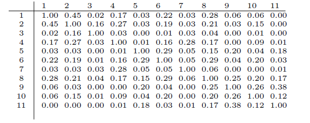
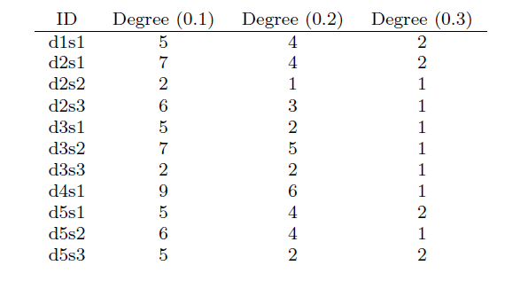

# LexRank
## 句子中心性和基于形心的摘要
一个句子的中心性通常是根据它所包含的词的中心性来定义的。评估词中心性的一种常见方法是在向量空间中查看文档集群的质心。集群的质心是一个由单词组成的伪文档。
## 基于中心性的句子显著性
一个文档集合可以看作是一个句子网络，一些句子和其他句子更具有相似性，也有一些句子只有很少的信息与其他句子相关。*假设：一个句子和剩下所有句子的相似度越大，则它的显著性越高。*问题在于：
>1. 如何定义相似性
>2. 如何根据相似性计算中心性

对于第一个问题，使用“词袋”模型的N维向量表示每个句子，N表示所有可能出现的词的个数，每一维的值代表的是该词的tf-idf值。
$$ idf-modified-cosine(x,y) = \frac{\sum_{w\in x,y}tf_{w,x}tf_{w,y}(idf_w)^2}{\sqrt{\sum_{x_i\in x}(tf_{x_i,x}idf_{x_i})^2}\times\sqrt{\sum_{y_i\in y}(tf_{y_i,y}idf_{y_i})^2}} $$
最后一个集群中的的所有文档则可以表示成一个cosine相似度矩阵。如下图所示

ID“DXSY”表示第X文档的第Y个句子。
### 度中心性算法
任意两个句子间的相似度都是在[0,1]之间的，通过一个相似度阈值，可以直观看出句子之间的相关性，即高于阈值的视为相似，低于阈值的视为不相似。最后可以统计每个句子和集群中所有句子相似的个数。

度中心性算法的问题在于，该算法将所有的句子节点视为同等重要的。但是现实中却不是如此，比如社交网络中一个用户的重要程度不是看他朋友的数量，而是要看其朋友的重要性。即一个节点的中心性等于其相邻节点中心性的加和平均。PageRank算法就是基于这种考虑所设计的算法。
$$ p(u)=\sum_{v \in adj[u]} \frac{p(v)}{deg(v)}$$
其中是节点u的中心度，adj[u]是u的邻接点，deg(v)是v的度数。
$$ p^TB = p^T$$
$$B(i,j)=\frac{A(i,j)}{\sum_kA(i,k)}$$
其中B(i,j)表示从i到j的转移矩阵，A表示相似度矩阵。另外，为了保证转移矩阵随机游走，Markov链要保证不可约，即$X^n(i,j)\neq0$。一个不可约的非周期马尔可夫链保证收敛于一个独特的平稳分布。如果马尔科夫链有可约或周期分量，随机游走可能会卡在这些分量中，永远不会访问图的其他部分。为了保证相似度矩阵永远是不可约和非周期的，保留一个很小的概率。
$$p(u)=\frac{d}{N}+(1-d)\sum_{v \in adj[u]}\frac{p(v)}{deg(v)}$$
其中N表示图中所有节点数，d是阻尼因子（0.1、0.2）

基于图形的中央中心有几个优势。首先,它说明了在句子中形成的结合。如果一个句子中的信息内容在一个集群中还原了另一个句子,自然喜欢包含包含更多信息的摘要。cos相似图中的一个节点的程度是一个不定式,即句子与其他句子有多少共同的信息。在图1中,d4s1的d4s1获得了最高的分数,因为它几乎将信息放在集群的前两个句子中,并与他人有一些共同的信息。我们提出的方法的另一个优点是,它可以防止不自然的高idf分数提高一个与这个话题无关的句子的分数。虽然在计算质心分数时考虑到单词的频率,但包含许多具有高idf值的罕见词的句子可能会得到一个高质心的分数,即使这些单词在集群中的其他地方不会出现。
